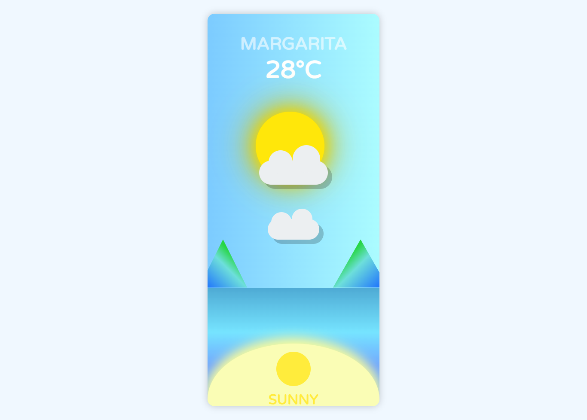

# Margarita Weather Card

Margarita Weather Card is a simple web application that displays the weather for Margarita Island in Venezuela. It features a visually appealing design with animated elements such as the sun, clouds, and mountains.

## Inspiration

This project was inspired by a repository that contains a variety of project suggestions. You can find the repository [here](https://github.com/Xtremilicious/projectlearn-project-based-learning).

Or you can go directly to the original article [here](https://dev.to/kokaneka/dynamic-weather-app-using-just-css-cp2).

## Screencapture

## Process

### Build with

- Semantic HTML5 markup
- CSS custom properties
- Flexbox
- Desktop-first workflow

### Leasons Learned

- CSS Animations: Learned how to create smooth animations using CSS, such as the `cloud-movement` animation. Also gained experience in using keyframes to define the stages of an animation.
- Responsive Design: Improved skills in making web applications responsive to different screen sizes. Utilized media queries to adjust the layout and design for various devices.
- HTML Structure: Reinforced knowledge of semantic HTML to create a well-structured and accessible web page.
- Inspiration and Adaptation: Discovered the value of drawing inspiration from existing project suggestions and adapting them to create something unique.

## Continued Development

For future improvements I would like to add a few features:

- JavaScript Integration: To dynamically update the weather information based on real-time data.
- Responsive Design: Ensure the card looks good on various screen sizes and devices.
- Additional Weather Details: Include more detailed weather information such as humidity, wind speed, and forecast.

## Acknowledgements

- [MDN Web Docs](https://developer.mozilla.org/en-US/docs/Web/CSS) For comprehensive CSS documentation.
- [W3 Schools](https://www.w3schools.com/css/) For CSS tutorials and references.
- [Tutorial to draw a sun](https://www.youtube.com/watch?v=lM2ristJ1JM&t=182s) For guidance on drawing a sun using CSS.
- [Tutorial to draw a cloud](https://lauryndbrown.github.io/2017/06/08/creating-clouds-in-css.html) For instructions on creating clouds with CSS.

## Authors

- [@gustavo2023](https://github.com/gustavo2023)
